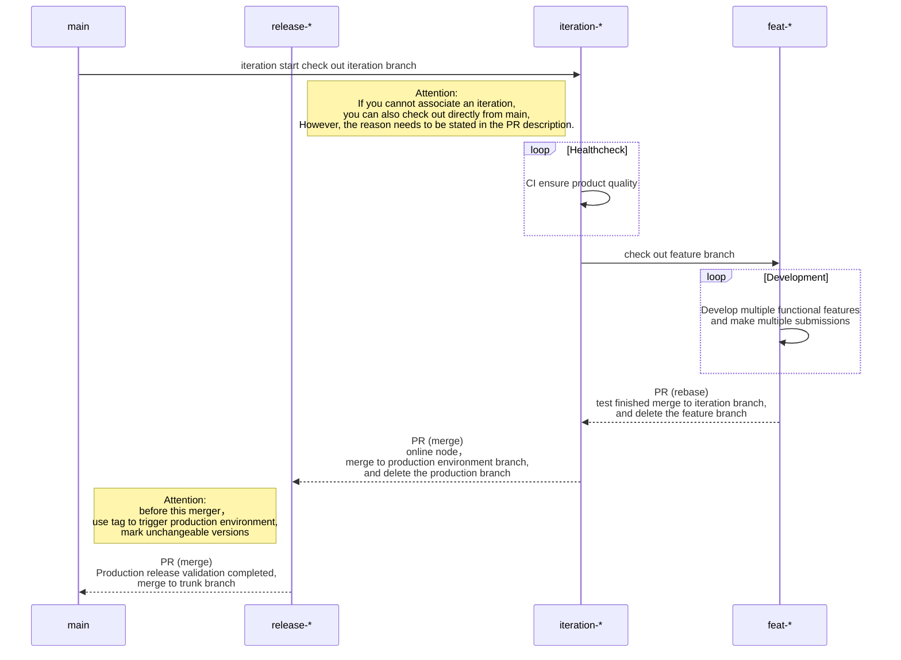
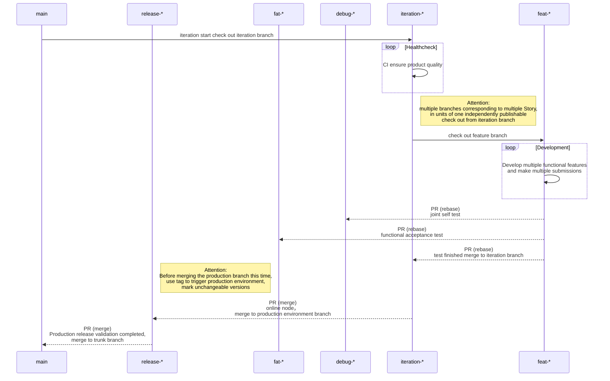

- 查看 [中文](../CONTRIBUTING_DOC/zh-CN/CONTRIBUTING.md)

## Contributor Guidelines

This project uses PullRequest workflow for code contribution, please refer [Contribution Workflow](#contribution-workflow)

## Issues

### Feature Requests

If you have ideas or how to improve our project, you can suggest new features through the work order. Be sure to include
details about the feature or change and describe any use cases it will enable.

Feature requests will be tagged as `[enhancement]` and their status will be updated in the comments of the issue.

### Enhancement Requests

If you have ideas or how to improve our project, you can improve the function by opening a ticket. Be sure to include
details about the feature or change and describe any use cases it will enable.

Enhancement requests will be tagged as `[enhancement]` and their status will be updated in the comments of the issue.

### Bugs

When reporting a bug or unexpected behaviour in a project, make sure your issue describes steps to reproduce the
behaviour, including the platform you were using, what steps you took, and any error messages.

Reproducible bugs will be tagged as `[bug]` and their status will be updated in the comments of the issue.

### Wontfix

Issues will be closed and tagged as `[wontfix]` if we decide that we do not wish to implement it, usually due to being
misaligned with the project vision or out of scope. We will comment on the issue with more detailed reasoning.

### version number rule

- using the semantic version the original [semver 2.0.0 https://semver.org/ ](https://semver.org/)
- core rules
  - Software using Semantic Versioning MUST declare a public API. This API could be declared in the code itself or
    exist strictly in documentation. However it is done, it SHOULD be precise and comprehensive.
  - Once a versioned package has been released, the contents of that version MUST NOT be modified. Any modifications
    MUST be released as a new version.
  - MAJOR version: when you make incompatible API changes
  - MINOR version: when you add functionality in a backward compatible manner
  - PATCH version: when you make backward compatible bug fixes
  - this document is to be interpreted as described in [RFC 2119](https://datatracker.ietf.org/doc/html/rfc2119)

e.g.

```
# Each element MUST increase numerically
1.9.1 -> 1.10.0 -> 1.11.0

# Major version zero (0.y.z) is for initial development. Anything MAY change at any time
# The public API SHOULD NOT be considered stable.
0.1.0 -> 0.2.0 -> 0.3.0

# Version 1.0.0 defines the public API. The way in which the version number is incremented after this release is dependent on this public API and how it changes.
1.0.0 -> 1.1.0 -> 1.2.0

# Patch version Z (x.y.Z | x > 0) MUST be incremented if only backward compatible bug fixes are introduced. A bug fix is defined as an internal change that fixes incorrect behavior.
1.0.0 -> 1.0.1 -> 1.0.2

# Minor version Y (x.Y.z | x > 0) MUST be incremented if new, backward compatible functionality is introduced to the public API.
1.0.0 -> 1.1.0 -> 1.2.0

# Major version X (X.y.z | X > 0) MUST be incremented if any backward incompatible changes are introduced to the public API.
1.0.0 -> 2.0.0 -> 3.0.0
```

## Contribution Workflow

### workflow view description

- `Project` Project view, the view of the entire project, can be associated with multiple git repositories.
- `View` : Iteration view, an iteration or route planning view in the project view, can be associated with multiple git
  warehouses, has a clear iteration plan, and is the kanban view of PR process.
- `Story` : Story view, a table view composed of a group of work orders, generally appears in a git warehouse and has a
  clear description of the demand.
- `Milestone`: The milestone view can only appear in a git repository and has a clear time node for version release.
- `Pull`: Merging request views and initiating PR generation views can only appear in one git warehouse, with clear
  description of merging demands, which is the work communication view of the whole PR process.
- `Issue` : The work order view, the most basic view of the workflow, can be optionally associated with the above views.

### library level workflow

- `main` : The trunk branch is an archive branch that retains the latest stable version of the code.
- `release-*` : Production the production environment branch, which is used to release the production environment after
  testing, `*` is the expected release version number
- `*-iteration-*` : iteration branch, the branch checked out from main at the beginning of each iteration, is used to
  maintain the development code maintenance integration for an iteration cycle. The beginning sign `*-` is `{issue number}-`.
- `*-feature-*` : Features feature branches, multiple branches corresponding to multiple Story in each iteration, which are
  checked out from iteration branch in units of a function that can be independently published. The beginning sign `*-` is `{issue number}-`.

Branch change process:

> Note that the beginning of `{issue number}-` is simplified here. In actual development, it is necessary to use `{issue number}-{type}-{description}` to maintain branches according to requirements.



- after the test is completed
    - `*-feature-*` feature branch will be deleted
- after completing the release
    - `*-iteration-*` iteration branch is deleted
    - `release-*` the production environment branch will be deleted

Only the 'main' trunk branch and many 'tag' and version information are kept as the final.

### product level workflow

the product level is much more extra, joint debugging self test environment branch `*-debug-*` and functional acceptance
test environment branch `*-fat-*`

- `main` : The trunk branch is an archive branch that retains the latest stable version of the code.
- `release-*` : Production the production environment branch, which is used to release the production environment after
  testing, `*` is the expected release version number
- `*-fat-*` : Feature Acceptance Test, functional acceptance test environment for software tester testing. The beginning sign `*-` is `{issue number}-`.
- `*-debug-*` : debugging branch, Used for front-end and back-end joint debugging tests, as well as code self-test and
  release, using the iteration code (view-id) mark.The beginning sign `*-` is `{issue number}-`.
- `*-iteration-*` : iteration branch, the branch checked out from main at the beginning of each iteration, is used to
  maintain the development code maintenance integration for an iteration cycle. The beginning sign `*-` is `{issue number}-`.
- `*-feature-*` : Features feature branches, multiple branches corresponding to multiple Story in each iteration, which are
  checked out from iteration branch in units of a function that can be independently published. The beginning sign `*-` is `{issue number}-`.

Branch change process: 

> Note that the beginning of `{issue number}-` is simplified here. In actual development, it is necessary to use `{issue number}-{type}-{description}` to maintain branches according to requirements.



- after the test is completed
    - `*-feature-*` feature branch will be deleted
- after completing the release
    - `*-iteration-*` iteration branch is deleted
    - `release-*` the production environment branch will be deleted
- due to the accession branch `*-fat-*` `*-debug-*`
    - In the current iteration, it will be retained as an iteration number.
    - Iteration is completed, the collection of iteration information is deleted at this iteration point in time and is
      not allowed to be used again.

Only the 'main' trunk branch and many 'tag' and version information are kept as the final.

### Open Issues

If you're ready to contribute, new issues click here [issues/new/choose](../../../../../issues/new/choose)

> if this repo has opend issues, start by looking at our open issues tagged
> as [`help wanted`](../../../../../issues?q=is%3Aopen+is%3Aissue+label%3A"help+wanted")
> or [`good first issue`](../../../../../issues?q=is%3Aopen+is%3Aissue+label%3A"good+first+issue").

You can comment on the issue to let others know you're interested in working on it or to ask questions.

### Making Changes

1. Fork the repository.

2. Create a new feature branch.

3. Make your changes. Ensure that there are no build errors by running the project with your changes locally.

4. git commit use [https://www.conventionalcommits.org/](https://www.conventionalcommits.org/)

- Can use command tools
  as: [cz-cli](https://github.com/commitizen/cz-cli#conventional-commit-messages-as-a-global-utility)


- vscode
  plugin `Conventional Commits`  [https://marketplace.visualstudio.com/items?itemName=vivaxy.vscode-conventional-commits](https://marketplace.visualstudio.com/items?itemName=vivaxy.vscode-conventional-commits)

`Command + Shift + P` or `Ctrl + Shift + P` enter `Conventional Commits` or `cc `, and press `Enter`


- jetbrains IDE can
  use `Conventional Commit` [https://plugins.jetbrains.com/plugin/13389-conventional-commit](https://plugins.jetbrains.com/plugin/13389-conventional-commit)


5. Open a pull request with a name and description of what you did. You can read more about working with pull requests
   on git [here](https://help.github.com/en/articles/creating-a-pull-request-from-a-fork).

6. A maintainer will review your pull request and may ask you to make changes.

## Commit Specification

> For more, See [Commit convention](https://www.conventionalcommits.org/en/v1.0.0/)

### Format

> Commit message includes three parts：header，body and footer, which separated by blank lines.

```
<type>[optional scope]: <description>
// blank lines
[optional body]
// blank lines
[optional footer(s)]

```

#### Header

Header has only one line, including three fields：`type`（required），`scope`（），description（required）

The types of `type` includes：

| type     | instructions                                                                                                                                                   |
|----------|----------------------------------------------------------------------------------------------------------------------------------------------------------------|
| feat     | new feature                                                                                                                                                    |
| fix      | fixes                                                                                                                                                          |
| perf     | changes improving code performance                                                                                                                             |
| style    | Changes to the format class of the code, like using `gofmt` to format codes, delete the blank lines, etc.                                                      |
| refactor | Changes to other classes of the code, which do not belong to feat、fix、perf and style, like simplifying code, renaming variables, removing redundant code, etc. |
| test     | Add test cases or update existing test cases                                                                                                                   |
| ci       | Changes to continuous integration and continuous deployment, like modifying Ci configuration files or updating systemd unit files.                             |
| docs     | Updates to document classes, including modifying user documents, developing documents, etc.                                                                    |
| chore    | Other types, like building processes, dependency management, changes to auxiliary tools, etc.                                                                  |

`scope` is used to illustrate the scope of the impact of commit, scope is as follows:

- tskv
- meta
- query
- docs
- config
- tests
- utils
- \*

`description` is the short description of commit, which is specified not to exceed 72 characters.

#### Body

> Body is a detailed description of this commit, which can be divided into multiple lines.
>
> Notes:
>
> - Use the first person and present tense, like using change instead of changed or changes.
> - Describe the motivations for code changes in detail and the comparison of before and after behavior

#### Footer

> If the current code is not compatible with the previous version, the Footer section begins with BREAKING CHANGE, which
> is followed by a description of the changes, as well as the reasons for the changes and the method of migration.
>
> Close Issue, if the current commit is for an issue, you can close the issue in the Footer section

```
Closes #1234,#2345

```

#### Revert

> In addition to the Header, Body, and Footer, Commit Message has a special case: If the current commit restores a
> previous commit, it should start with revert:, which is followed by a header of a restored commit. Besides, it must be
> written as This reverts commit in the Body. Among them, hash is the SHA identity of the commit to be restored.

## generate kit

- See `gitea-conventional-kit` to get more info