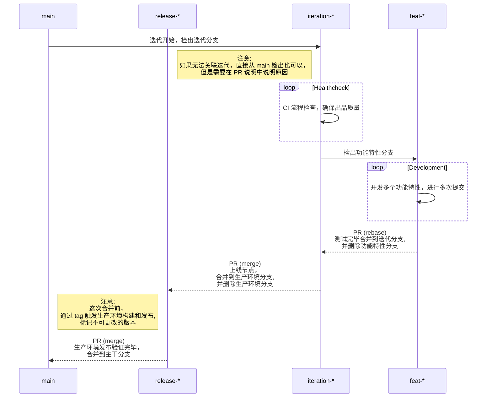
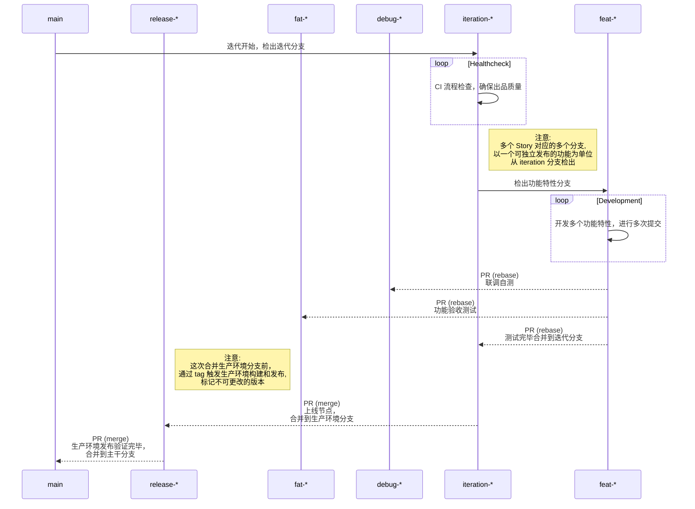

## 贡献者指南

本项目使用 PullRequest 工作流进行代码贡献, 请参考 [PullRequest 工作流说明](#pullrequest-工作流说明)

## Issues 工单说明

### 新功能请求

如果您有想法或如何改进我们的项目，您可以通过打工单来建议新功能。确保包含有关功能或更改的详细信息，并描述它将启用的任何用例。

功能请求将被标记为 `[feature]`，并且其状态将在问题的注释中更新。

### 改进功能请求

如果您有想法或如何改进我们的项目，您可以通过打开工单来改进功能。确保包含有关功能或更改的详细信息，并描述它将启用的任何用例。

功能请求将被标记为 `[enhancement]`，并且其状态将在问题的注释中更新。

### Bugs

在报告项目中的bug或意外行为时，请确保您的问题描述了重现行为的步骤，包括您使用的平台、您采取的步骤以及任何错误消息。

可重现的错误将被标记为 `[bug]`，并且其状态将在问题的注释中更新。

### 不会修复

如果我们决定不希望实施问题，通常是由于与项目愿景不一致或超出范围而导致问题将被关闭并标记为 `[wontfix]`。我们将用更详细的推理来评论这个问题。

### 版本号规则

- 使用语义化版本，原文 [semver 2.0.0 https://semver.org/ ](https://semver.org/)
- 核心规则
  - 使用语义版本控制的软件必须声明一个公共应用编程接口。这个应用编程接口可以在代码本身中声明，也可以严格保留档。不管怎么做，它应该是精确和全面的。
  - 发布版本化包后，不得修改该版本的内容。任何修改都必须作为新版本发布
  - 主版本号：当你做了不兼容的 API 修改
  - 次版本号：当你做了向下兼容的功能性新增
  - 修订号：当你做了向下兼容的问题修正
  - 先行版本号及版本编译信息可以加到后面，并且符合 [RFC 2119](https://datatracker.ietf.org/doc/html/rfc2119)

例子:

```
# 必须（MUST）以数值来递增版本号
1.9.1 -> 1.10.0 -> 1.11.0

# 主版本号为零（0.y.z）的软件处于开发初始阶段，一切都可能随时被改变
# 这样的公共 API 不应该被视为稳定版
0.1.0 -> 0.2.0 -> 0.3.0

# 1.0.0 的版本号用于界定公共 API 的形成。这一版本之后所有的版本号更新都基于公共 API 及其修改内容
1.0.0 -> 1.1.0 -> 1.2.0

# 修订号 指的是针对不正确结果而进行的内部修改
1.0.0 -> 1.0.1 -> 1.0.2

# 次版本号 有向下兼容的新功能出现时递增
1.0.0 -> 1.1.0 -> 1.2.0

# 主版本号 在有任何不兼容的修改被加入公共 API 时递增
1.0.0 -> 2.0.0 -> 3.0.0
```

## PullRequest 工作流说明

### 工作流视图说明

- `Project` 项目视图，整个项目的视图，可以关联多个 git 仓库
- `View` : 迭代视图，项目视图内一个 迭代 或者 路线规划的 视图，可以关联多个 git 仓库，有明确的迭代计划，是 PR 流程的看板视图
- `Story` : 故事视图，一组工单组成的表格视图，一般在一个 git 仓库中出现，有明确的诉求说明
- `Milestone`: 里程碑视图, 只能在一个 git 仓库中出现，有明确的时间节点，用于版本发布
- `Pull`: 合并请求视图，发起 PR 产生视图，只能在一个 git 仓库中出现，有明确的合并诉求说明，是整个 PR 流程的工作沟通视图
- `Issue` : 工单视图，工作流最基础的视图，可选择关联到 上述的各种视图中

### 依赖库级 工作流

- `main` : 主干分支, 是一个归档分支, 保留最新的一个稳定版本代码
- `release-*` : Production 生产环境分支, 用于测试完毕后发布生产环境，`*` 为 预计发布版本号
- `*-iteration-*` : iteration 迭代分支, 每个迭代开始时从 main 检出的分支, 用于维护一个迭代周期的开发代码维护整合，开头标识 `*-` 为 `工单号-`
- `*-feature-*` : Features 功能特性分支, 每个迭代多个 Story 对应的多个分支, 以一个可独立发布的功能为单位从 iteration 分支检出，开头标识 `*-` 为 `工单号-`

分支变动流程: 

> 注意这里简化了 `工单号-` 开头，实际开发中，需要根据需求，使用 `{工单号}-{类型}-{描述}` 来维护分支



- 测试完成后
    - `*-feature-*` 功能特性分支会被删除
- 完成发布后
    - `*-iteration-*` 迭代分支会被删除
    - `release-*` 生产环境分支会被删除

最终效果为，只保留 `main` 主干分支 和很多 `tag` 以及 版本版信息

### 产品级项目 工作流

产品级额外多了 联调自测环境分支 `*-debug-*` 和 功能验收测试环境分支 `*-fat-*`

- `main` : 主干分支, 是一个归档分支, 保留最新的一个稳定版本代码
- `release-*` : Production 生产环境分支, 用于测试完毕后发布生产环境
- `*-fat-*` : Feature Acceptance Test功能验收测试环境，用于 软件测试者测试使用，开头标识 `*-` 为 `工单号-`
- `*-debug-*` : debugging 开发环境分支, 用于前后端联调测试, 以及代码自测发布使用，使用 迭代号(view-id) 标记，开头标识 `*-` 为 `工单号-`
- `*-iteration-*` : iteration 迭代分支, 开头标识 `*-` 为 `工单号-`，每个迭代开始时从 main 检出的分支, 用于维护一个迭代周期的开发代码维护整合, 使用
  迭代号(view-id) 标记，也就是说同一迭代，debug 和 iteration 只有一个
- `*-feature-*` : features 功能特性分支, 开头标识 `*-` 为 `工单号-`，每个迭代多个 Story 对应的多个分支, 以一个可独立发布的功能为单位从 iteration 分支检出

分支变动流程:

> 注意这里简化了 `工单号-` 开头，实际开发中，需要根据需求，使用 `{工单号}-{类型}-{描述}` 来维护分支



- 测试完成后
    - `*-feature-*` 功能特性分支会被删除
- 完成发布后
    - `*-iteration-*` 迭代分支会被删除
    - `release-*` 生产环境分支会被删除
- 由于加入的 `*-fat-*` 和 `*-debug-*` 分支
    - 在当前迭代会以 迭代号保留
    - 迭代完成，收集迭代信息，会被删除在这个迭代时间点，不允许再次使用

最终效果为，只保留 `main` 主干分支 和很多 `tag` 以及 版本版信息

### 新建 Issues

如果您准备贡献，请单击此处 [issues/new/choose](../../../../../../issues/new/choose)

> 如果此repo已打开问题，请首先查看我们标记为 
> [`help wanted`](../../../../../../issues?q=is%3Aopen+is%3Aissue+label%3A"help+wanted")
> 或者 [`good first issue`](../../../../../../issues?q=is%3Aopen+is%3Aissue+label%3A"good+first+issue").

你可以对这个问题发表评论，让别人知道你有兴趣解决这个问题，或者提出问题.

### 更改代码流程

1. Fork 存储库

2. 创建一个新的 feature branch.

3. 进行更改。通过在本地运行带有更改的项目来确保没有构建错误。

4. git commit 使用 [https://www.conventionalcommits.org/](https://www.conventionalcommits.org/)

- 可以使用命令工具作为: [cz-cli](https://github.com/commitizen/cz-cli#conventional-commit-messages-as-a-global-utility)


-
vscode插件 `Conventional Commits`  [https://marketplace.visualstudio.com/items?itemName=vivaxy.vscode-conventional-commits](https://marketplace.visualstudio.com/items?itemName=vivaxy.vscode-conventional-commits)

`Command + Shift + P` 或者 `Ctrl + Shift + P` 输入 `Conventional Commits` or `cc `, 并按 `Enter`


- jetbrains IDE
  可以使用 `Conventional Commit` [https://plugins.jetbrains.com/plugin/13389-conventional-commit](https://plugins.jetbrains.com/plugin/13389-conventional-commit)


5. 新建一个 pull request
   ，其中包含您所做的工作的名称和描述。您可以阅读有关在GitHub上处理拉取请求的更多信息 [here](https://help.github.com/en/articles/creating-a-pull-request-from-a-fork).

6. 维护者将审查您的拉取请求，并可能要求您进行更改。

## Commit规范

> 详细内容请参考：[Commit规范](https://www.conventionalcommits.org/en/v1.0.0/)

### 格式

> Commit message 包含三个部分：header，body和footer，中间用空行隔开。

```
<type>[optional scope]: <description>
// 空行
[optional body]
// 空行
[optional footer(s)]
```

#### Header

Header只有一行，包含三个字段：`type`（必需），`scope`（可选），description（必需）

`type`的种类包括：

| 类型       | 说明                                                       |
|----------|----------------------------------------------------------|
| feat     | 新增功能                                                     |
| fix      | Bug修复                                                    |
| perf     | 提高代码性能的变更                                                |
| style    | 代码格式类的变更，比如用`gofmt`格式化代码、删除空行等                           |
| refactor | 其他代码类的变更，这些变更不属于feat、fix、perf和style，例如简化代码、重命名变量、删除冗余代码等 |
| test     | 新增测试用例或是更新现有测试用例                                         |
| ci       | 持续集成和部署相关的改动，比如修改CI配置文件或者更新systemd unit文件                |
| docs     | 文档类的更新，包括修改用户文档或者开发文档等                                   |
| chore    | 其他类型，比如构建流程、依赖管理或者辅助工具的变动等                               |

`scope`用于说明commit影响的范围，scope 如下：

- tskv
- meta
- query
- docs
- config
- tests
- utils
- \*

`description`是commit的简短描述，规定不超过72个字符

#### Body

> Body是对本次commit的详细描述，可以分成多行
>
> 注意点：
>
> - 使用第一人称现在时，比如使用change而不是changed或changes。
> - 详细描述代码变动的动机，以及前后行为的对比

#### Footer

> 如果当前代码与上一个版本不兼容，则 Footer 部分以BREAKING CHANGE开头，后面是对变动的描述、以及变动理由和迁移方法。

> 关闭Issue，如果当前 commit 针对某个issue，那么可以在 Footer 部分关闭这个 issue

```
Closes #1234,#2345
```

#### Revert

> 除了 Header、Body 和 Footer 这 3 个部分，Commit Message 还有一种特殊情况：如果当前 commit 还原了先前的 commit，则应以
> revert: 开头，后跟还原的 commit 的 Header。而且，在 Body 中必须写成 This reverts commit ，其中 hash 是要还原的 commit 的
> SHA
> 标识。

## 生成套件

- See `gitea-conventional-kit` to get more info